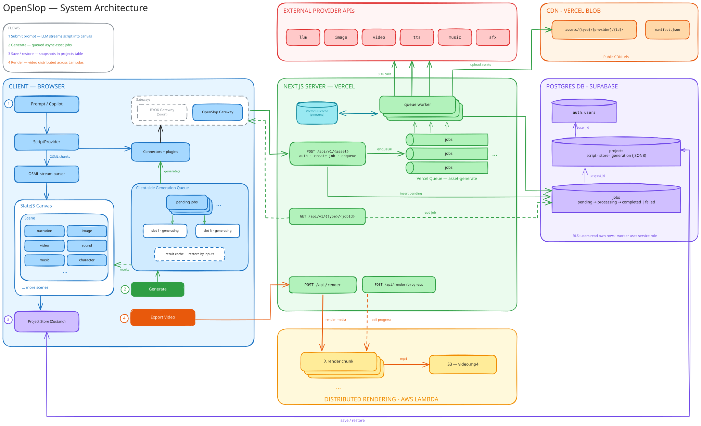

# Architecture

A 10k-foot view of how OpenSlop fits together.

> To edit the diagram, open [`docs/architecture.excalidraw`](./docs/architecture.excalidraw) at [excalidraw.com](https://excalidraw.com) (or the VS Code Excalidraw extension), then re-export the SVG to `docs/architecture.svg`.

## Flows

### 1. Submit prompt

The prompt goes through the LLM connector to `POST /api/v1/llm`, which streams OSML back over SSE. The parser inserts elements into the SlateJS canvas as they arrive.

### 2. Generate

Generate resolves the element into a dependency graph (see [Generation graph](#generation-graph)) and queues the stale nodes client-side, dependencies first, `DEFAULT_BATCH_SIZE` at a time. Each job is submitted to `POST /api/v1/{asset}`, which records a `jobs` row and enqueues to the Vercel Queue. Workers call the provider, upload results to Vercel Blob, and mark the job complete. The client polls until the asset URL arrives and the preview updates. Music and sfx check a Pinecone similarity cache first.

### 3. Save / restore

Project state (script, store, and generation snapshots) persists to the `projects` row and rehydrates on load. Generated results survive reloads.

### 4. Render

`POST /api/render` splits the composition across Remotion Lambdas. Chunks render in parallel into an MP4 in S3 while the client polls for progress. Compositions live in `remotion/` and `lib/video/`. The Player is loaded client-side only.

## Three layers

The generation pipeline is split so providers and asset types can be swapped independently:

- **Connectors** (`lib/connectors/`): what the editor calls. Model-agnostic, plugin-pipelined, return an `AssetResult`.
- **Gateways** (`lib/gateway/`): thin HTTP clients between connectors and our `/api/v1/*` routes. This seam lets connectors run against the live API or a mock. Today there is one OpenSlop gateway. A BYOK gateway will be added so users can call providers with their own API keys.
- **Providers** (`lib/providers/`): server-side adapters for vendors (Runware, ElevenLabs, Cartesia, Anthropic). Call the vendor SDK, upload assets, return a bundle response.

## API routes

Every route that takes request data is built from a factory in `lib/api/route-handler.ts` that handles auth, parsing, model validation, and error mapping. One `routeHandler(authTier, parseSource)` builder produces them all, so the factories vary only along those two axes: `createApiRouteHandler` (api-access, JSON body), `createSessionRouteHandler` (session, JSON body), `createApiQueryRouteHandler` (api-access, search params), `createSessionFormRouteHandler` (session, multipart form), `createPublicRouteHandler` (no auth, JSON body), and `createPublicQueryRouteHandler` (no auth, search params). Every handler receives the parsed, validated payload as `input`, whatever the source. Two routes fall outside that shape: `api/queues/asset-generate` is a `@vercel/queue` callback and `auth/callback` is an OAuth redirect. Reusable Zod field schemas live in `lib/api/request-schema-fields.ts`. If a provider's API key isn't set, the route falls back to a mock provider.

## Generation graph

A generation is a small dependency graph, not a lone job. `lib/generation/graph.ts` defines it:

- A **node** is one unit of generation, keyed by element id, holding `inputs` (the authored prompt plus non-layout attributes) and `dependsOn` edges.
- A **source node** stands for project state that is read rather than generated: art style, reference images, aspect ratio, a character's voice (`sourceNodes.ts`). It has no job, and its identity is its own inputs.
- Edges come from the plugin chain. A connector plugin declares `dependencies(element)`, so one declaration drives what a job reads, what it waits for, and what makes it stale.

`resolveGraph.ts` turns a `NodeSpec` such as `forElement(element)` into the built node and everything under it, resolving each element's connector and deduping nodes shared within the call. `useNodeBuilder` supplies the connector registry and a project-state snapshot, and rebuilds on any store write.

Staleness falls out of the graph: a node needs generating when it has no result, when a dependency does, or when its current inputs differ from the inputs its result was made from. One element (`useGenerate`) and Generate All (`useGenerateAll`) run the same check. A result the user supplied is `pinned` and never regenerated.

`queue.ts` runs the graph. It flattens roots dependencies-first, skips nodes that are already fresh, and holds only what is in flight: the pending nodes, the abort controllers, and the batch limit. Everything that outlives a run lives beside it:

- `snapshots.ts` is the per-element record (status, elapsed seconds, result, error, the inputs that result was made from) plus a result history keyed by serialized inputs, so undoing an edit restores the earlier result instead of regenerating it. It is also the subscription observers read through; mutators leave notifying to the caller so a batch of edits lands as one update.
- `elapsedTicker.ts` counts whole seconds for running jobs and keeps its interval alive only while something is running.

## Editor state

- `lib/generation/` decides what to generate and runs it, as above. The UI dispatches nodes; it never calls connectors directly.
- `lib/project/store.ts` holds per-project metadata in Zustand. Every mutation rule lives in a store action. Components subscribe to reactive state through `useProject(selector)`; `getProjectStore(projectId)` is the escape hatch for imperative access that a render-time selector can't express — hooks doing one-shot init, `.subscribe`, or reads outside render (`ProjectEditor`, `useAutosave`, `useGenerateAll`), and the orchestration that starts a generation. A plugin never reaches for the store to read: it is handed the state snapshot its caller resolved inputs against, as `ctx.state`. `voice-hydrate` is the one plugin holding a store handle, because it writes.
- `lib/canvas/elementConnector.ts` answers "which connector, provider and model does this element use?" for both the UI and the queue. An element pins its provider when created, so this is also where a pin that no longer resolves falls back to the registry default.
- `lib/script/` provides script context and refinement utilities.
- `app/components/canvas/hooks/useEditorSession.ts` is the one place the Slate editor gets wired to a project: initial hydration, streaming script sync, metadata sync, and autosave. Views call it and render the editor; they never assemble it.
- `lib/project/autosave.ts` owns saving: it builds the row from the store snapshot, script and generation snapshot, then debounces and serializes writes so a slow save can't land after a newer one. `useAutosave` only subscribes the editor value, the store, and the queue to it, and turns the result into a toast.

## Data

Supabase Postgres with RLS (users only read their own rows; queue workers use the service role):

| Table        | Purpose                                                                              |
| ------------ | ------------------------------------------------------------------------------------ |
| `auth.users` | Supabase auth users                                                                  |
| `projects`   | One row per project: `script` (text) plus `store` and `generation` snapshots (JSONB) |
| `jobs`       | Async generation jobs: `pending → processing → completed \| failed`                  |

Generated assets live in Vercel Blob under `assets/{type}/{provider}/{id}/`, served as public CDN URLs.

## Auth

- `proxy.ts` (Next.js 16's renamed middleware, keep this name) refreshes the Supabase session on each request.
- API routes have two auth tiers, both defined in `lib/api/with-auth.ts`:
  - `withApiAccess` (`/api/v1/*`): same-origin Supabase session cookie plus the `api_access` grant in `app_metadata` (403 without it).
  - `withSession` (`/api/render*`, `/api/upload/*`): any signed-in user.

## Adding a new asset type

Add a connector + gateway + provider, register the provider in `lib/api/providers.ts`, declare a models map, and add the route under `app/api/v1/<type>`. Tests live in `__tests__` folders next to the code.
