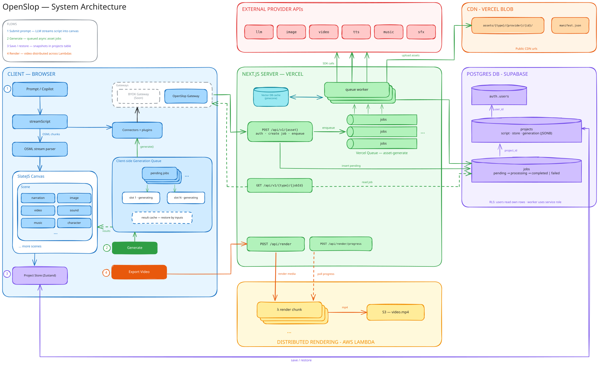
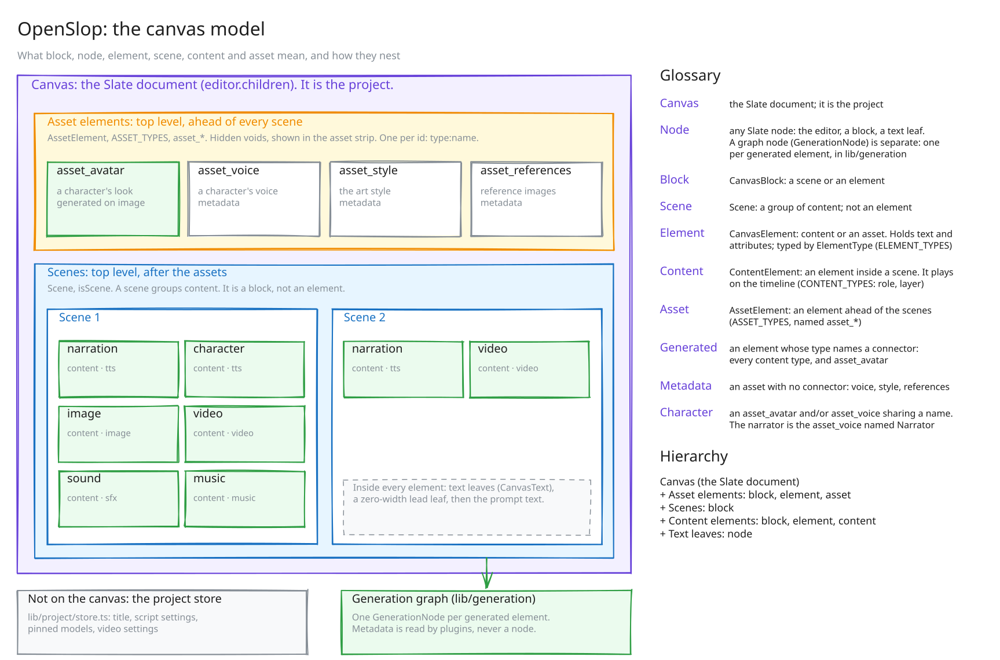

# Architecture



> To edit the diagram, open [`docs/architecture.excalidraw`](./docs/architecture.excalidraw) at [excalidraw.com](https://excalidraw.com), then re-export the SVG to `docs/architecture.svg`.

## Flows

1. **Write.** Sloppy adds the assets a script needs to the canvas, then sends a prompt to the LLM route, which streams OSML back. The parser inserts elements into the Slate canvas as they arrive.
2. **Generate.** The client queues stale graph nodes, dependencies first, and posts each to an asset route. The route records a `jobs` row and enqueues it on the Vercel Queue. A worker runs the job's handler, uploads the result to Vercel Blob, and the client polls until it arrives. A video job redelivers itself to poll the vendor.
3. **Save.** The canvas, the project store (title, render and script settings, pinned models) and the generation snapshots save to the `projects` row, with autosaved history in `canvas_versions`.
4. **Render.** Remotion Lambdas render chunks in parallel into an MP4 in S3.

## Sloppy

The agent in the editor's left panel (`app/components/sloppy/`, domain in `lib/agent/`, turns run by `lib/api/agentTurn.ts`). The server streams text and tool calls; the client runs each tool against the Slate editor and posts the result back until the model answers in text. Only the client writes the project.

## Vocabulary

- **Model**: a `{ provider, model }` pair, such as Claude Opus 5 on Anthropic.
- **Provider**: the vendor serving a model (Anthropic, Runware, ElevenLabs, Cartesia, or OpenSlop's hosted gateway). A user connects one by storing a key.
- **Provider key**: a user's credential for a provider, one row per user and provider in `provider_keys`, stored in Vault.
- **Connector** (internal): turns a canvas element into a generation request. It decides which attributes the element exposes for its model.

## Layers

- **Connectors** (`lib/connectors/`): what the editor calls. One class per media type, extended by plugins.
- **Gateways** (`lib/gateway/`): HTTP clients from connectors to our routes. `/api/v1` serves models OpenSlop hosts; `/api/third-party` serves models a user brings a key for.
- **Providers** (`lib/providers/`): server-side vendor adapters, shared by both route families.

## Models and keys

`MODELS[type][provider][name]` in `lib/connectors/models.ts` lists every model. Each element stores its own pair as attributes. Speech uses the voice pair stored on its speaker's `asset_voice`, if it has one. Defaults resolve element, then project, then account, then the recommendation.

The two route families are defined in `lib/api/route-families.ts`. `HOSTED` requires API access, takes a model name and uses our keys. `BYOK` requires a session, takes the pair and uses the user's key. A job stores the pair; the worker builds the provider from it.

User keys live in Supabase Vault. They are read by the service role only for the request that uses them and are never sent to a client. A key is verified by calling the vendor.

## Canvas and generation



> To edit the diagram, open [`docs/canvas-model.excalidraw`](./docs/canvas-model.excalidraw) at [excalidraw.com](https://excalidraw.com), then re-export the SVG to `docs/canvas-model.svg`.

The Slate document (`lib/canvas/`) is the project. Each term below means one thing everywhere in the code:

| Term          | Type                            | Means                                                                                                                                                                                        |
| ------------- | ------------------------------- | -------------------------------------------------------------------------------------------------------------------------------------------------------------------------------------------- |
| **Canvas**    | `editor.children`               | The Slate document. It is the project.                                                                                                                                                       |
| **Node**      | Slate `Node`                    | Any Slate node: the editor, a block or a text leaf. A _graph node_ (`GenerationNode`) is separate: one per generated element, in `lib/generation/`.                                          |
| **Block**     | `CanvasBlock`                   | A scene or an element.                                                                                                                                                                       |
| **Scene**     | `Scene`                         | A group of content. A scene is a block, not an element.                                                                                                                                      |
| **Element**   | `CanvasElement`, `ElementOf<T>` | Content or an asset. It holds text and attributes, and its type is an `ElementType` declared in `ELEMENT_TYPES`.                                                                             |
| **Content**   | `ContentElement`                | An element inside a scene. It plays on the timeline; its type is declared in `CONTENT_TYPES` with a role and a layer.                                                                        |
| **Asset**     | `AssetElement`                  | An element ahead of the scenes. Its type is declared in `ASSET_TYPES` and named `asset_*`.                                                                                                   |
| **Generated** | `GeneratedElement`              | An element whose type names a connector: every content type, and `asset_avatar`. Each is a node in the generation graph.                                                                     |
| **Metadata**  |                                 | An asset with no connector: `asset_voice`, `asset_style` and `asset_references`. Plugins read it; it is never a graph node.                                                                  |
| **Character** |                                 | An `asset_avatar` and/or an `asset_voice` sharing a `name`. The avatar's text is how they look; the voice's attributes are how they sound. The narrator is the `asset_voice` named Narrator. |

The hierarchy:

```
Canvas
├─ Asset elements      (block, element, asset)
└─ Scenes              (block)
   └─ Content elements (block, element, content)
      └─ Text leaves   (node)
```

Assets come first, then the scenes. An asset is known by its type and name, never its id, and there is one of each. The asset strip above the script shows the assets, one tile per character, and their nodes stay out of the caret's reach. A type generates, and takes a model, when its spec names a connector. Content takes its connector's attributes; an asset's are its own (`ASSET_ATTRIBUTES` in `lib/canvas/elementConnector.ts`).

`lib/project/` keeps what is not on the canvas in a Zustand store: the title, the render settings (aspect ratio, captions, caption style, transition), the script settings (language, length, format, template) and the project's pinned default models. It also owns saving and version history.

Each generated element is a node in a dependency graph (`lib/generation/`). A node holds the element's text, its attributes, the metadata its plugins read, and edges to the generated elements it uses. Per-type behaviour comes from the plugins installed in `lib/connectors/registry.ts`:

- **Dependencies:** edges to other generated elements, such as a character's avatar or the previous visual.
- **Reads:** metadata values, recorded under a label. A change makes the result stale, and the stale reason names the label.
- **Prepare:** writes assets when a job starts, before the node is built to run, such as searching for a voice when the speaker has none on the model. The node is then built from the canvas as written, so those writes don't make the result stale.
- **Hooks:** `transformPrompt`, `beforeGenerate`, `afterGenerate`.

A node regenerates when it has no result, when a dependency regenerates, or when its inputs changed. The queue runs dependencies first, with a concurrency limit per connector type, and builds each node again from the live canvas when its job starts.

Each content type's card controls are declared in `app/components/canvas/elements/elementConfigs.tsx`.

## Data

Supabase Postgres with row-level security. Queue workers use the service role.

| Table             | Purpose                                                             |
| ----------------- | ------------------------------------------------------------------- |
| `projects`        | Canvas (as OSML), project store and generation snapshots            |
| `canvas_versions` | Autosaved history of those columns                                  |
| `jobs`            | Async generation jobs: `pending → processing → completed \| failed` |
| `provider_keys`   | One row per user and provider: vault id, last four, status          |
| `conversations`   | One Sloppy conversation per project                                 |
| `messages`        | Its turns                                                           |

Generated assets live in Vercel Blob as public CDN URLs.

## Auth

`proxy.ts` refreshes the Supabase session on each request. `withApiAccess` guards `/api/v1/*` (a session plus the `api_access` grant). `withSession` guards every other signed-in route, including BYOK.

## Adding things

- **Hosted model:** a row in its type's `openslop/models.ts` and a row in `lib/api/providers/openslop.ts`.
- **BYOK provider:**
  - an entry in the provider catalog;
  - a models map under `lib/connectors/<type>/<provider>/`;
  - a class per type in the vendor table, each with `validate()`.
- **New media type:** a connector, a provider, a models map, a row in `lib/api/asset-routes.ts`, and two route files.
- **Per-type generation behaviour:** a plugin, installed in `lib/connectors/registry.ts`.

Tests live in `__tests__` folders next to the code.
