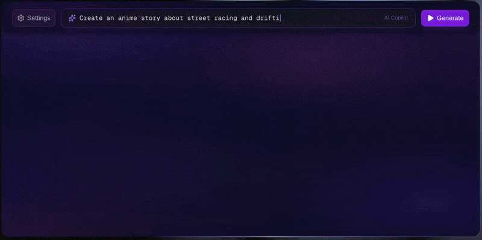

<div align="center">

# OpenSlop

**Free, open-source AI video creator.**

[](LICENSE)
[](https://nextjs.org)
[](https://react.dev)
[](https://www.typescriptlang.org)
[](https://supabase.com)
[](https://tailwindcss.com)
[](https://discord.gg/zeP5482ced)

<br />



</div>

---

OpenSlop connects all your favorite AI tools into one workflow and helps you create consistent, engaging video content in minutes. No more jumping between ten tabs.

Open-source and free forever.

**Website:** [openslop.ai](https://openslop.ai) | **App:** [app.openslop.ai](https://app.openslop.ai)

## What is this?

OpenSlop is a video creation tool for people who want to make AI-generated content that actually looks good. You bring your AI accounts, OpenSlop brings the workflow.

- Connects to multiple AI providers in one place
- Gives you a real editing workflow, not just a prompt box
- Runs in your browser, no install needed
- Built by engineers from Meta, Google, Stripe, and Dropbox

## Getting Started

### Prerequisites

- [Node.js](https://nodejs.org) 18+
- A [Supabase](https://supabase.com) project (for auth and database)

### Setup

1. Clone the repo:

```bash
git clone https://github.com/openslop/openslop.git
cd openslop
```

2. Install dependencies:

```bash
npm install
```

3. Set up your environment variables:

```bash
cp .env.example .env.local
```

Fill in your Supabase project URL and anon key:

```
NEXT_PUBLIC_SUPABASE_URL=https://your-project.supabase.co
NEXT_PUBLIC_SUPABASE_ANON_KEY=your-anon-key
```

4. Run the database migrations:

```bash
npm run db:push
```

5. Start the dev server:

```bash
npm run dev
```

Open [http://localhost:3000](http://localhost:3000) and you should see the app.

## Tech Stack

| Layer     | Tech                                                                                                         |
| --------- | ------------------------------------------------------------------------------------------------------------ |
| Framework | [Next.js 16](https://nextjs.org) (App Router)                                                                |
| Language  | [TypeScript 5](https://www.typescriptlang.org)                                                               |
| UI        | [React 19](https://react.dev), [Tailwind CSS 4](https://tailwindcss.com), [shadcn/ui](https://ui.shadcn.com) |
| Auth + DB | [Supabase](https://supabase.com) (Auth, Postgres, RLS)                                                       |
| Icons     | [Lucide](https://lucide.dev)                                                                                 |

## Project Structure

```
openslop/
|-- app/                    # Next.js App Router pages and layouts
|   |-- api/                # API routes
|   |-- auth/               # Auth callback handler
|   |-- components/         # App-specific React components
|   |-- login/              # Login page
|   |-- signup/             # Signup page
|   |-- page.tsx            # Home / editor
|   |-- layout.tsx          # Root layout
|-- components/ui/          # shadcn/ui primitives
|-- lib/                    # Shared utilities
|   |-- supabase/           # Supabase client helpers (browser, server, middleware)
|   |-- utils.ts            # General utilities (cn, etc.)
|-- supabase/migrations/    # Database migrations
|-- middleware.ts           # Auth session refresh + route protection
```

## Scripts

| Command            | What it does                |
| ------------------ | --------------------------- |
| `npm run dev`      | Start the dev server        |
| `npm run build`    | Production build            |
| `npm run start`    | Start the production server |
| `npm run lint`     | Run ESLint                  |
| `npm run db:push`  | Push migrations to Supabase |
| `npm run db:reset` | Reset the database          |

## Contributing

Contributions welcome. Fork the repo, make your changes, open a PR.

Please read `CLAUDE.md` for the project's coding conventions before submitting.

## Community

[](https://discord.gg/zeP5482ced)

Questions, ideas, or just want to hang out? [Join our Discord](https://discord.gg/zeP5482ced) or [email us](mailto:hi@openslop.ai).

## License

MIT
