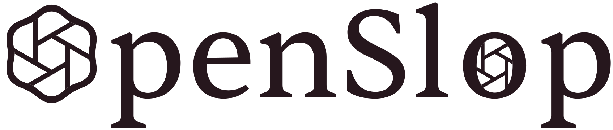

<p align="center">
  
</p>

<p align="center"><b>Free, open-source AI video creator.</b></p>

<p align="center">
  <a href="https://openslop.ai"></a>
  <a href="LICENSE"></a>
  <a href="https://nextjs.org"></a>
  <a href="https://react.dev"></a>
  <a href="https://www.typescriptlang.org"></a>
  <a href="https://supabase.com"></a>
  <a href="https://tailwindcss.com"></a>
  <a href="https://discord.gg/zeP5482ced"></a>
</p>

<p align="center">
  <a href="https://openslop.ai"><b>openslop.ai</b></a>
  &nbsp;·&nbsp;
  <a href="https://app.openslop.ai">app.openslop.ai</a>
</p>

<p align="center">
  
</p>

---

> **Private beta.** Invite-only right now.
> [Hop on the waitlist at openslop.ai](https://openslop.ai) to get in.

## Overview

OpenSlop wires all your favorite AI tools into one workflow so you can make good-looking video in minutes, no more jumping between ten tabs. You bring your AI accounts, OpenSlop brings the workflow. That's it.

Open-source, free forever.

## Key capabilities

- Talk to a bunch of AI providers in one place
- A real editing workflow, not just a prompt box
- Runs in your browser, nothing to install
- Built by engineers from Meta, Google, Stripe, and Dropbox

## Getting started

### Prerequisites

- [Node.js](https://nodejs.org) 20.9+ (Next.js 16's minimum; CI runs 22)
- A [Supabase](https://supabase.com) project (for auth and database)

### Setup

1. Clone the repo:

```bash
git clone https://github.com/openslop/openslop.git
cd openslop
```

2. Install dependencies:

```bash
npm install
```

3. Create a `.env.local` file with your environment variables:

Required (auth and database):

```
NEXT_PUBLIC_SUPABASE_URL=https://your-project.supabase.co
NEXT_PUBLIC_SUPABASE_ANON_KEY=your-anon-key
SUPABASE_SECRET_KEY=your-service-role-key   # generation jobs read/write with it
```

Without provider keys, the app falls back to mock providers. To use real ones, add any of:

```
ANTHROPIC_API_KEY=        # LLM
RUNWARE_API_KEY=          # Image + video
ELEVENLABS_API_KEY=       # Music + SFX
CARTESIA_API_KEY=         # Text-to-speech
BLOB_READ_WRITE_TOKEN=    # Vercel Blob (asset storage)
NEXT_PUBLIC_BLOB_URL=     # Vercel Blob public URL
PINECONE_API_KEY=         # Reuses similar past music/SFX generations; unset disables the cache
```

4. Run the database migrations:

```bash
npm run db:push
```

5. Start the dev server:

```bash
npm run dev
```

Open [http://localhost:3000](http://localhost:3000) and you should see the app.

## Tech stack

| Layer     | Tech                                                                                                         |
| --------- | ------------------------------------------------------------------------------------------------------------ |
| Framework | [Next.js 16](https://nextjs.org) (App Router)                                                                |
| Language  | [TypeScript 5](https://www.typescriptlang.org)                                                               |
| UI        | [React 19](https://react.dev), [Tailwind CSS 4](https://tailwindcss.com), [shadcn/ui](https://ui.shadcn.com) |
| Auth + DB | [Supabase](https://supabase.com) (Auth, Postgres, RLS)                                                       |
| Video     | [Remotion 4](https://remotion.dev) (composition, rendering, player)                                          |
| Storage   | [Vercel Blob](https://vercel.com/docs/storage/vercel-blob) (generated asset storage)                         |
| Icons     | In-house masked-SVG set (`components/ui/icon.tsx` + `icons.css`), no icon dependency                         |

## Project structure

```
app/             Next.js routes, API endpoints, and editor components
  api/v1/        REST API per asset type (image, video, music, sfx, tts, llm)
  components/    Editor UI (canvas, video preview, etc.)
lib/
  agent/         Sloppy: tool definitions, registry, prompt and turn context
  connectors/    Editor-facing client API per asset type
  gateway/       HTTP clients to /api/v1/*
  providers/     Server-side vendor adapters (Runware, ElevenLabs, …)
  generation/    Generation queue and job orchestration
  canvas/        Slate document model: element types, guards, OSML parse/serialize
  script/        Script context and refinement
  project/       Per-project Zustand store, autosave, persistence
  video/         Scene layout and render client
  templates/     Prompt templates offered in the composer
  upload/        Client-side image upload
  supabase/      Browser/server Supabase clients
remotion/        Remotion entry point and compositions
supabase/        Database migrations
```

See [`ARCHITECTURE.md`](ARCHITECTURE.md) for how these layers interact.

## Scripts

| Command                   | What it does                |
| ------------------------- | --------------------------- |
| `npm run dev`             | Start the dev server        |
| `npm run build`           | Production build            |
| `npm run lint`            | ESLint                      |
| `npm run format:check`    | Prettier check              |
| `npm run typecheck`       | TypeScript check            |
| `npm run knip`            | Dead-code check             |
| `npm run test:run`        | Run tests once (Vitest)     |
| `npm run test:e2e`        | Smoke tests (Playwright)    |
| `npm run db:push`         | Push migrations to Supabase |
| `npm run remotion:studio` | Open Remotion Studio        |

## Contributing

Contributions welcome. Fork it, make your changes, run the checks, open a PR.

Read these first:

- [`CONVENTIONS.md`](CONVENTIONS.md) is the coding style. The codebase is rigid and opinionated on purpose, so match what's there.
- [`ARCHITECTURE.md`](ARCHITECTURE.md) shows how connectors, gateways, providers and the generation queue fit together.
- [`AGENTS.md`](AGENTS.md) has the workflow and tooling notes for AI coding agents

## Community

<p align="center">
  <a href="https://discord.gg/zeP5482ced"></a>
</p>

Questions, ideas, or just want to hang out? [Join our Discord](https://discord.gg/zeP5482ced) or [email us](mailto:hi@openslop.ai).

## License

Licensed under the [Apache License 2.0](LICENSE).
