<p align="center">
  <picture>
    <source media="(prefers-color-scheme: dark)" srcset="../../assets/openslop-lockup-animated-dark.svg">
    
  </picture>
</p>

<p align="center"><b>免费、开源的 AI 视频创作工具。</b></p>

<p align="center">
  <a href="https://openslop.ai"></a>
  <a href="../../LICENSE"></a>
  <a href="https://nextjs.org"></a>
  <a href="https://react.dev"></a>
  <a href="https://www.typescriptlang.org"></a>
  <a href="https://supabase.com"></a>
  <a href="https://tailwindcss.com"></a>
  <a href="https://discord.gg/zeP5482ced"></a>
</p>

<p align="center">
  <sub><a href="../../README.md">English</a> · 中文 · <a href="README.ja.md">日本語</a> · <a href="README.ko.md">한국어</a> · <a href="README.es.md">Español</a> · <a href="README.fr.md">Français</a> · <a href="README.pt.md">Português</a></sub>
</p>

<p align="center">
  <a href="https://openslop.ai"><b>openslop.ai</b></a>
  &nbsp;·&nbsp;
  <a href="https://app.openslop.ai">app.openslop.ai</a>
</p>

<p align="center">
  <picture>
    <source media="(prefers-color-scheme: dark)" srcset="../../assets/openslop-demo-dark.svg">
    
  </picture>
</p>

---

> **私测中。** 目前仅限邀请。
> [到 openslop.ai 加入等候名单](https://openslop.ai)，等你进来。

## 概览

OpenSlop 把你喜欢的 AI 工具串成一条工作流，几分钟就能做出好看的视频，不用再在十个标签页之间来回跳。你带上自己的 AI 账号，OpenSlop 带上工作流。就这么简单。

它在浏览器里运行，什么都不用装。开源，永久免费。由来自 Meta、Google、Stripe 和 Dropbox 的工程师打造。

## 功能

<table>
<tr>
<td width="50%" valign="middle">

### 描述你的视频

打一行字。选 16:9 或 9:16、一种语言、一个模型和一个时长，或者直接粘贴你已有的脚本。没头绪的话，还有七个模板可以帮你起步。

[编辑器 →](../../app/components/copilot/ComposerCopilot.tsx)

</td>
<td width="50%">
  <a href="../../app/components/copilot/ComposerCopilot.tsx"><picture>
    <source media="(prefers-color-scheme: dark)" srcset="../../assets/features/describe-dark.svg">
    
  </picture></a>
</td>
</tr>
<tr>
<td width="50%" valign="middle">

### Sloppy 和你一起写

副驾驶住在左侧面板里。它读脚本，列出故事大纲，写出场景，再把片段对到台词上。它做的每一步都会在你眼前落到画布上。

[一轮对话是怎么进行的 →](../../ARCHITECTURE.md#sloppy)

</td>
<td width="50%">
  <a href="../../ARCHITECTURE.md#sloppy"><picture>
    <source media="(prefers-color-scheme: dark)" srcset="../../assets/features/sloppy-dark.svg">
    
  </picture></a>
</td>
</tr>
<tr>
<td width="50%" valign="middle">

### 是分镜板，不是提示框

每个场景是一叠卡片：旁白、角色、图片、片段、音效、音乐。改任意一条提示词，为每张卡片单独选模型，拖动排序，鼠标停在哪里就能在哪里插入。

[文档模型 →](../../lib/canvas)

</td>
<td width="50%">
  <a href="../../lib/canvas"><picture>
    <source media="(prefers-color-scheme: dark)" srcset="../../assets/features/canvas-dark.svg">
    
  </picture></a>
</td>
</tr>
<tr>
<td width="50%" valign="middle">

### 一键生成全部

Generate all（全部生成）会把每个元素排进队列，并先处理依赖：先出一个场景所接续的片段再出该场景，先出头像再出它所在的图片。之后改了提示词，卡片会标上 **Stale**（已过期）并说明原因。

[生成图 →](../../ARCHITECTURE.md#generation-graph)

</td>
<td width="50%">
  <a href="../../ARCHITECTURE.md#generation-graph"><picture>
    <source media="(prefers-color-scheme: dark)" srcset="../../assets/features/generate-dark.svg">
    
  </picture></a>
</td>
</tr>
<tr>
<td width="50%" valign="middle">

### 播放器和时间线

一边生成一边看成片，字幕逐词显示。下面四条轨道：视频、人声、音效、音乐。拖动标尺，按场景跳转，或者切到分镜条。

[播放器 →](../../app/components/video)

</td>
<td width="50%">
  <a href="../../app/components/video"><picture>
    <source media="(prefers-color-scheme: dark)" srcset="../../assets/features/timeline-dark.svg">
    
  </picture></a>
</td>
</tr>
<tr>
<td width="50%" valign="middle">

### 带上你自己的密钥

托管模型随账号附带。粘贴一个 Anthropic、Runware、Cartesia 或 ElevenLabs 的密钥，它们的模型就会出现在每个选择器里。密钥存放在 Supabase Vault 中，永远不会到达浏览器。

[模型和提供商密钥 →](../../ARCHITECTURE.md#models-and-provider-keys)

</td>
<td width="50%">
  <a href="../../ARCHITECTURE.md#models-and-provider-keys"><picture>
    <source media="(prefers-color-scheme: dark)" srcset="../../assets/features/providers-dark.svg">
    
  </picture></a>
</td>
</tr>
</table>

**盒子里还有：**

- **[字幕](../../app/components/canvas/panel/CaptionsPanel.tsx)** — 六种预设、十二种字体、逐词或逐行显示，每种颜色、描边和位置都随你改。
- **[导出最高 4K](../../app/components/video/ExportButton.tsx)** — 在 Remotion Lambda 上分块并行渲染，交给你一个 MP4。
- **[版本历史](../../app/components/canvas/panel/CanvasHistoryPanel.tsx)** — 边做边自动保存，合并成检查点。查看任意版本并恢复。
- **[角色和画风](../../app/components/canvas/elements/AssetsSection.tsx)** — 给角色起一次名，每张图片、每句配音和每个头像都保持一致。
- **[模板](../../lib/templates/templates.ts)** — POV Life、Sleep Story、True Crime 等等。每个模板都预设了一种风格、一位旁白和一个时长。
- **[开发用的 mock](../../.env.example)** — 不填某个提供商的密钥，它的调用就会回退到预置结果，让你不花钱也能开发。

## 快速开始

### 前置条件

- [Node.js](https://nodejs.org) 20.9+（Next.js 16 的最低要求；CI 用的是 22）
- 一个 [Supabase](https://supabase.com) 项目（用于认证和数据库）

### 安装

1. 克隆仓库：

```bash
git clone https://github.com/openslop/openslop.git
cd openslop
```

2. 安装依赖：

```bash
npm install
```

3. 复制带注释的环境变量模板并填写：

```bash
cp .env.example .env.local
```

Supabase 的变量是必填的。其他都可选：没填密钥的提供商会回退到 mock。

4. 运行数据库迁移：

```bash
npm run db:push
```

5. 启动开发服务器：

```bash
npm run dev
```

打开 [http://localhost:3000](http://localhost:3000)，就能看到应用了。

## 技术栈

| 层级          | 技术                                                                                                         |
| ------------- | ------------------------------------------------------------------------------------------------------------ |
| 框架          | [Next.js 16](https://nextjs.org)（App Router）                                                               |
| 语言          | [TypeScript 5](https://www.typescriptlang.org)                                                               |
| UI            | [React 19](https://react.dev)、[Tailwind CSS 4](https://tailwindcss.com)、[shadcn/ui](https://ui.shadcn.com) |
| 认证 + 数据库 | [Supabase](https://supabase.com)（Auth、Postgres、RLS）                                                      |
| 视频          | [Remotion 4](https://remotion.dev)（合成、渲染、播放器）                                                     |
| 存储          | [Vercel Blob](https://vercel.com/docs/storage/vercel-blob)（生成资源的存储）                                 |
| 图标          | 自研的遮罩 SVG 图标集（`components/ui/icon.tsx` + `icons/`），无图标依赖                                     |

## 项目结构

```
app/             Next.js 路由、API 端点和编辑器组件
  api/v1/        按资源类型划分的 REST API（image、video、music、sfx、tts、llm）
  components/    编辑器 UI（画布、视频预览等）
lib/
  agent/         Sloppy：工具定义、注册表、提示词和对话轮次上下文
  connectors/    面向编辑器的客户端 API，按资源类型划分
  gateway/       访问 /api/v1/* 的 HTTP 客户端
  providers/     服务端的供应商适配器（Runware、ElevenLabs……）
  generation/    生成队列和任务编排
  canvas/        Slate 文档模型：元素类型、守卫、OSML 解析/序列化
  script/        脚本上下文和润色
  project/       每个项目的 Zustand store、自动保存、持久化
  video/         场景布局和渲染客户端
  templates/     编辑器里提供的提示词模板
  upload/        客户端图片上传
  supabase/      浏览器端/服务端的 Supabase 客户端
remotion/        Remotion 入口和合成
supabase/        数据库迁移
```

这些层之间如何交互，见 [`ARCHITECTURE.md`](../../ARCHITECTURE.md)。

## 脚本

| 命令                      | 作用                   |
| ------------------------- | ---------------------- |
| `npm run dev`             | 启动开发服务器         |
| `npm run build`           | 生产构建               |
| `npm run lint`            | ESLint                 |
| `npm run format:check`    | Prettier 检查          |
| `npm run typecheck`       | TypeScript 检查        |
| `npm run knip`            | 死代码检查             |
| `npm run test:run`        | 跑一次测试（Vitest）   |
| `npm run test:e2e`        | 冒烟测试（Playwright） |
| `npm run db:push`         | 把迁移推送到 Supabase  |
| `npm run remotion:studio` | 打开 Remotion Studio   |

## 参与贡献

欢迎贡献。安装步骤、检查顺序，以及我们在 PR 里看重什么，见 [`CONTRIBUTING.md`](../../CONTRIBUTING.md)。

## 社区

<p align="center">
  <a href="https://discord.gg/zeP5482ced"></a>
</p>

有问题、有想法，或者只是想来聊聊？[加入我们的 Discord](https://discord.gg/zeP5482ced) 或[给我们发邮件](mailto:hi@openslop.ai)。

社区里的每个人都应遵守我们的[行为准则](../../CODE_OF_CONDUCT.md)。如需举报问题，请发邮件到 [hi@openslop.ai](mailto:hi@openslop.ai)。

<a href="https://github.com/openslop/openslop/graphs/contributors">
  
</a>

## Star 历史

<p align="center">
  <a href="https://star-history.com/#openslop/openslop&Date">
    <picture>
      <source media="(prefers-color-scheme: dark)" srcset="https://api.star-history.com/svg?repos=openslop/openslop&type=Date&theme=dark">
      
    </picture>
  </a>
</p>

## 许可证

采用 [Apache 许可证 2.0](../../LICENSE) 授权。
